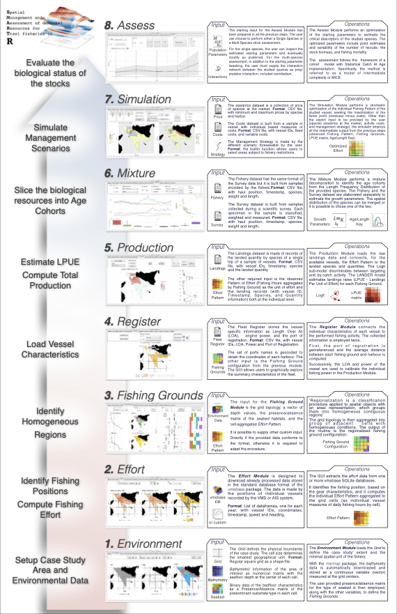

# smartR 

[](https://travis-ci.org/d-lorenz/smartR)
[](https://cran.r-project.org/package=smartR)
[](https://www.tidyverse.org/lifecycle/#maturing)

## Overview

A tool for assessing bio-economic feedback in different management scenarios ([D'Andrea et al., 2020](https://doi.org/10.1111/2041-210X.13394)). 'smartR' (Spatial Management and Assessment of demersal Resources for Trawl fisheries) combines information from different tasks gathered within the European Data Collection Framework for the fishery sector. The 'smartR' package implements the SMART model ([Russo et al., 2014](https://doi.org/10.1371/journal.pone.0086222)), through the object-oriented  programming paradigm, and within this package it is possible to achieve the  complete set of analyses required by the SMART approach: from the editing and formatting of the raw data; the construction and maintenance of coherent datasets; the numerical and visual inspection of the generated metadata; to the final simulation of management scenarios and the forecast of their effects. The interaction between the user and the application could take place through invocation of methods via the command line or could be entirely committed to the graphical user interfaces (GUI).

## Installation

``` r
# Install latest stable version from CRAN:
install.packages("smartR")

# Or the development version from GitHub:
# install.packages("devtools")
devtools::install_github("d-lorenz/smartR")
```

## Workflow

[](https://doi.org/10.1111/2041-210X.13394)

<a href="vignettes/smartR_Workflow.pdf">

</a>
